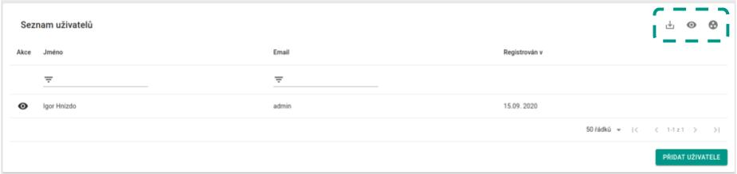
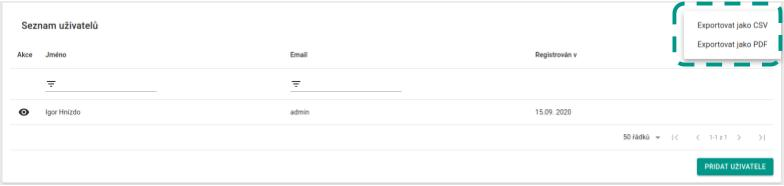
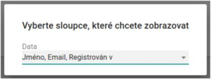
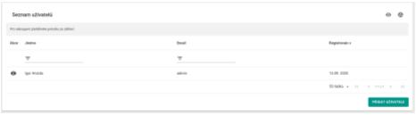
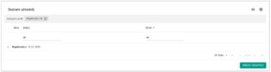
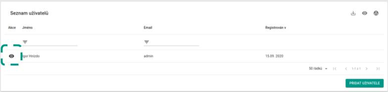
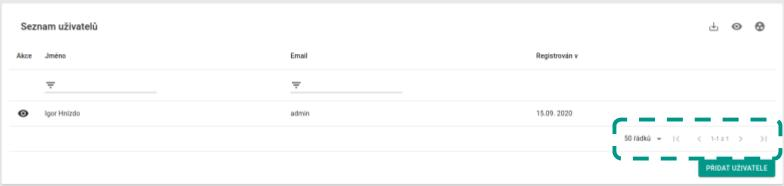

# Datová tabulka

## Globální akce
Globální akce se vždy vztahují k celé tabulce.  
Nachází se zde 3 akce - Exportovat, Sloupce, Seskupit

### Exportovat
Tlačítko `Exportovat` se nachází nejvíce vlevo a po kliknutí otevře menu, které vás vyzve k vybrání formátu uložení.  

### Sloupce
Tlačítko `Sloupce` slouží pro vybrání sloupců, které chete zobrazit v tabulce. Po kliknutí se zobrazí okno s výběrem.  

### Seskupit
Tlačítko `Seskupit` slouží k seskupení dat podle sloupce. Po kliknutí se vám zobrazí lišta nad tabulkou. 
Do této lišty přetáhněte název sloupce, podle kterého chcete data seskupit. Poté se data seskupí.  
  

## Akce
Akce se vždy vztahují k určitému řádku. Po najetí na akci se vám zobrazí dodatečné informace.

## Stránkování
Tabulka má několik stránek. Můžete se mezi nimi pohybovat pomocí šipek a můžete volit jejich velikost.

