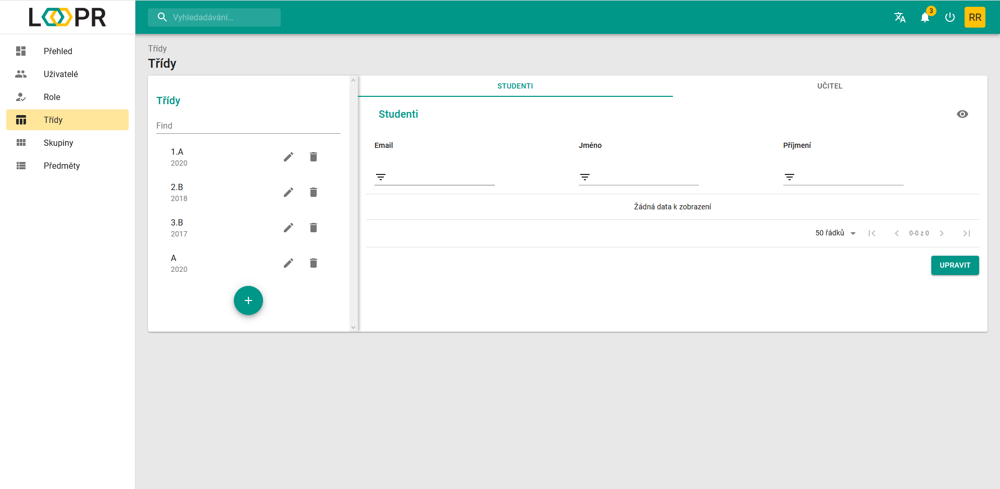
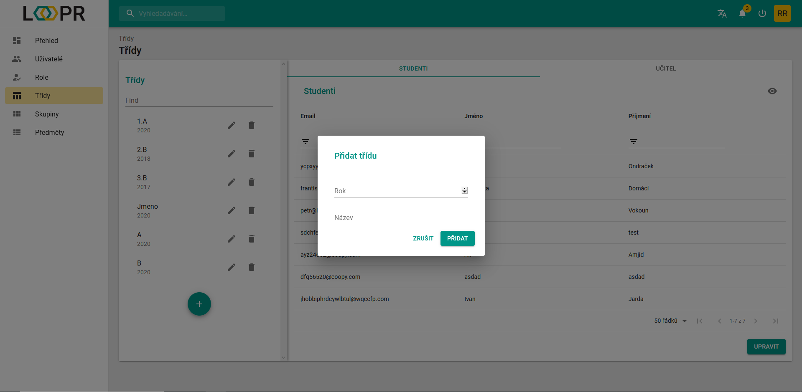
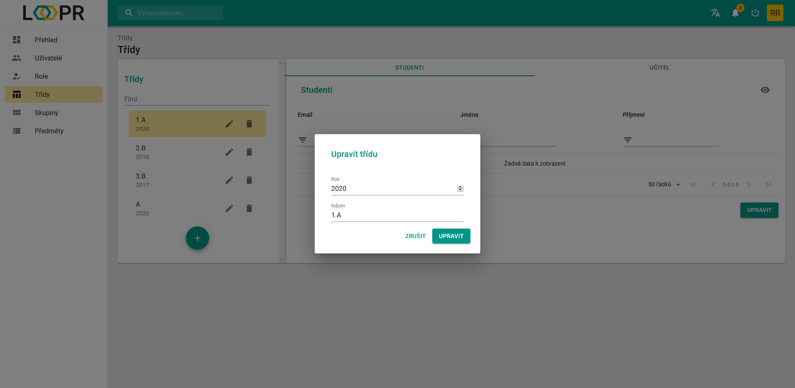
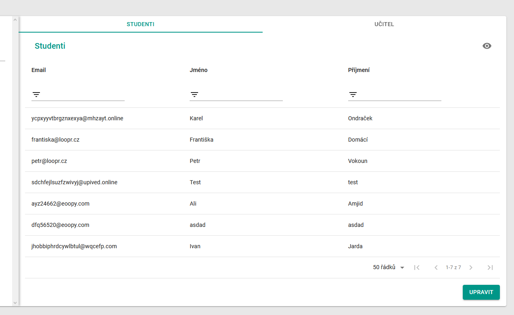
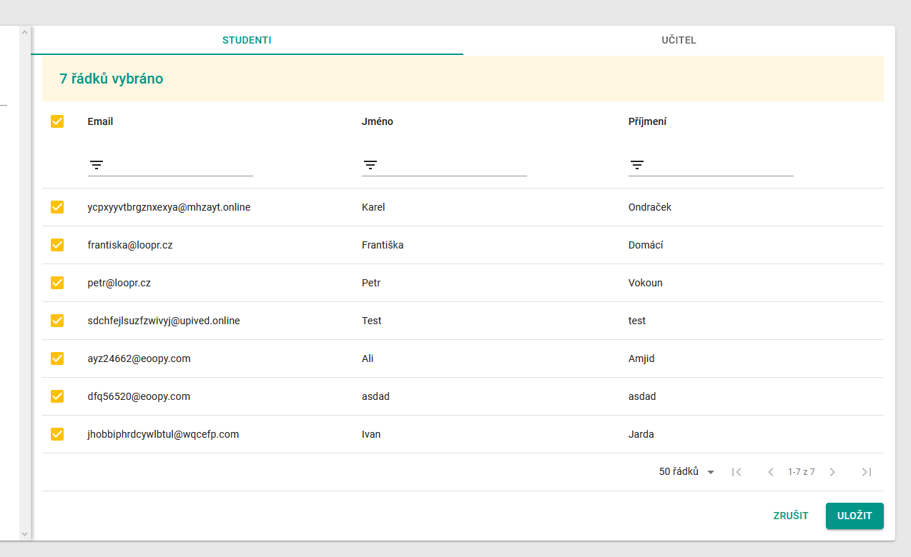
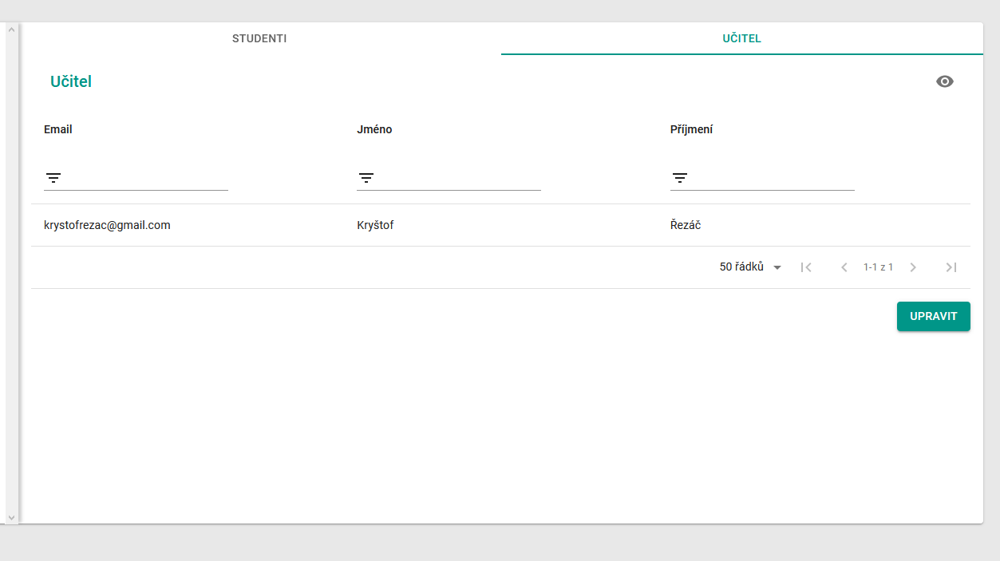
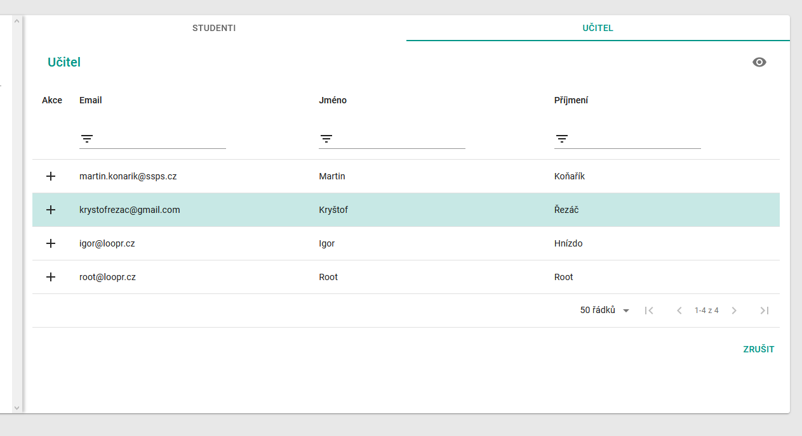

# Třídy
Stránka `Třídy` slouží k vytváření a upravování tříd. Třídy zde můžete naplnit studenty a přiřadit jim třídního učitele.

## Rozdělení stránky
Stránka je složená ze dvou sekcí. Z levé sekce "Seznam tříd" a pravé sekce s obsaženými daty o přiřazených studentech a učiteli. 

### Sekce Seznam tříd
Tato sekce funguje jako přehled vytvořených tříd. 

Třídy lze vytvořit pomocí `zeleného tlačítka +`.   
Otevře se dialog, do kterého je potřeba napsat rok nástupu třídy a její název.

Každou třídu lze přejmenovat (změnit název a rok nástupu) pomocí `ikony tužky` a odstranit pomocí `ikony koše`.   

Otevřené okno po kliknutí na `ikonu tužky`.

### Sekce s uživatelskými daty
Pro otevření nějaké třídy vyberte třídu v sekci "Seznam tříd" a klikněte na ní. V této pravé sekci se otevře tabulka se studenty.   
Lze přepínat mezi tabulkou se studenty a tabulkou s třídním učitelem.

#### Operace se studenty
Všechny ovládací prvky a práce s tabulkou jsou popsány zde: 
> [Datová tabulka](cs/components/materialTable/)

Pro úpravu studentů ve třídě klikněte na zelené tlačítko `upravit`.  

Pro výběr studentů zaškrtněte všechny preferované řádky a poté klikněte na tlačítko `uložit`.

#### Operace s učitelem
Všechny ovládací prvky a práce s tabulkou je popsána zde: 
> [Datová tabulka](cs/components/materialTable/)

Pro výběr třídního učitele klikněte na tlačítko `upravit`.

Pro volbu učitele klikněte na `+` vámi preferovaného řádku.

