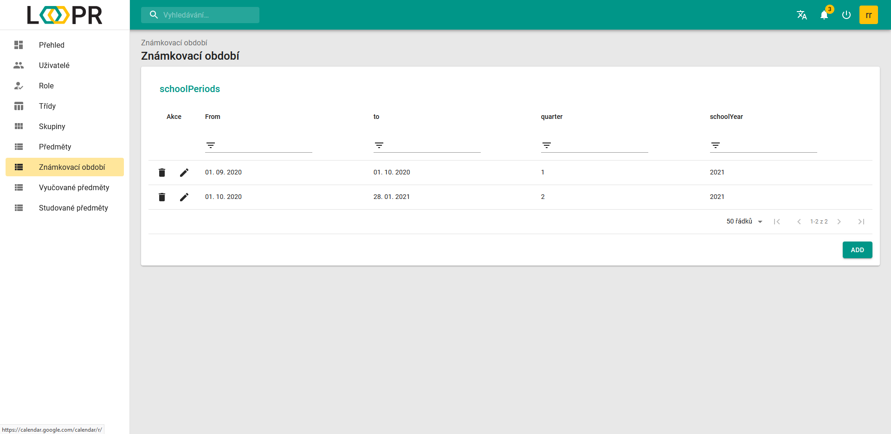

# Známkovací období
Stránka `Známkovací období` funguje jako tabulka všech známkovacích období. To si můžeme představit jako nějaký časový úsek, ve kterém se známkuje a pro který budou mít všechny třídy a skupiny jednu konečnou výstupní hodnotu v každém předmětu, například jedno čtvrtletí.

Pro každé známkovací se musí nastavit:  
* Počáteční den
* Závěrečný den
* Počet čtvrtletí (např. pro pololetí musíme nastavit 2)
* Školní rok

Popis práce s tabulkou je popsán v níže uvedeném odkazu:
> [Datová tabulka](cs/components/materialTable/)

