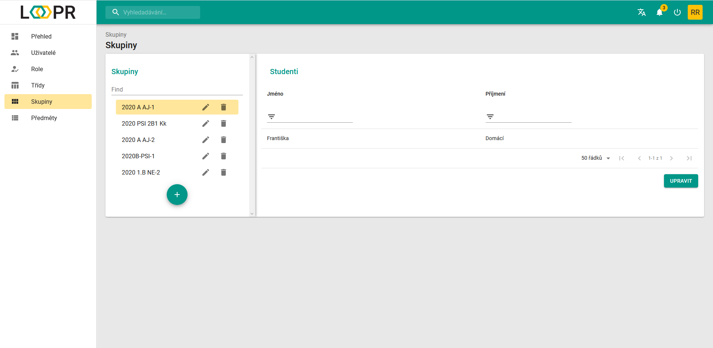
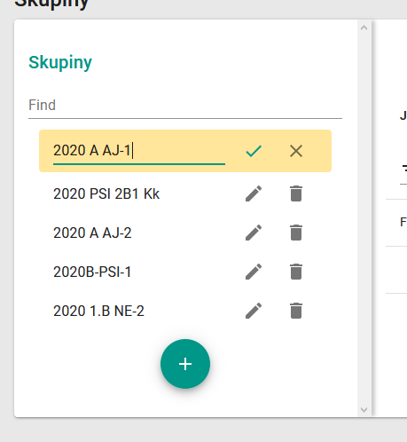
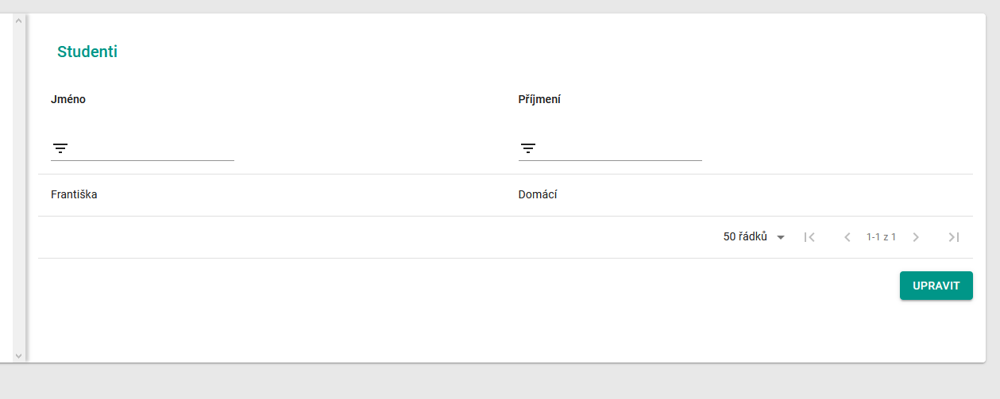
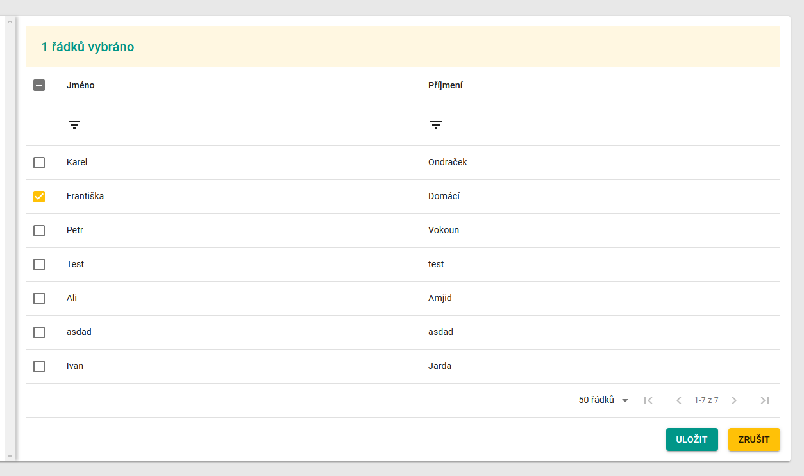

# Skupiny
Skupiny fungují jako jednotlivé útvary studentů, které poté lze přiřadit k různým předmětům s různými učiteli.   
Například pokud budete mít jeden nebo více předmětů, ve kterém se budete chtít, aby se nacházela pouze polovina třídy, např. rozdělena abecedně, vytvoříte pro ní skupinu. Skupiny lze tvořit také mezi různými třídami.

Přiřazování skupin k předmětům je možné v kartě [Předměty](cs/pages/subjects/)

## Rozdělení stránky
Karta Skupiny funguje na stejném principu jako karta [Třídy](cs/pages/classes/)

### Sekce Seznam skupin
V levé části se nachází Seznam skupin. 

Tato sekce funguje jako přehled vytvořených skupiny. 

Skupiny lze vytvořit pomocí `zeleného tlačítka +`.   
Otevře se dialog, do kterého je potřeba napsat pouze vaše pojmenování skupiny.

Každou skupinu lze přejmenovat pomocí `ikony tužky` a odstranit pomocí `ikony koše`. 

### Sekce s uživatelskými daty
Pro otevření nějaké skupiny vyberte třídu v sekci "Seznam skupin" a klikněte na ní. V této pravé sekci se otevře tabulka se studenty.

Všechny ovládací prvky a práce s tabulkou jsou popsány zde: 
> [Datová tabulka](cs/components/materialTable/)

Pro úpravu studentů ve skupině klikněte na zelené tlačítko `upravit`.

Pro výběr studentů zaškrtněte všechny preferované řádky a poté klikněte na tlačítko `uložit`.

