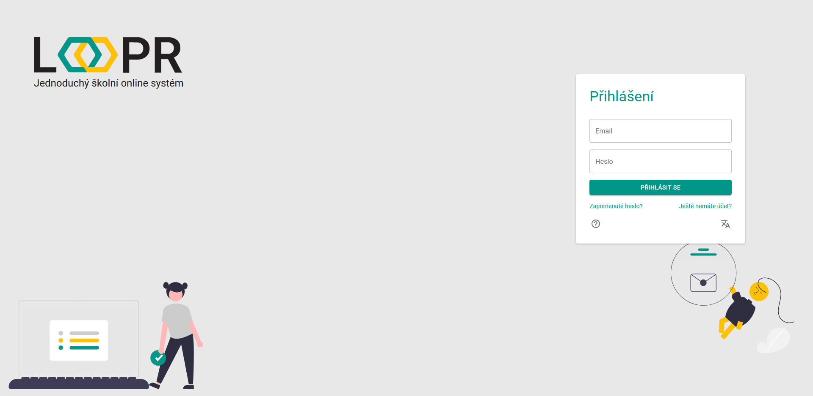

# Přihlášení
Stránka slouží k přihlášení uživatele do aplikace. K přihlášení je nutno zadat email a heslo a kliknout na zelené tlačítko `Přihlásit se`. 

V případě zapomenutí hesla, lze heslo obnovit pomocí odkazu `Zapomenuté heslo?`, který odkazuje na stránku s obnovou hesla.   
Pokud nemáte existující učet, klikněte na odkaz `Ještě nemáte účet?`, který odkazuje na stránku s podrobným popisem všech možností registrace.

Na formuláři se nachází dále `ikona nápovědy` s odkazem na nápovědu.    

   
V případě preference jiného jazyka lze jazyk změnit kliknutím na `ikonu změny jazyka`.   

