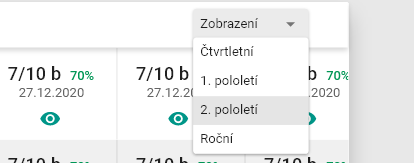
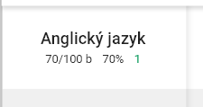
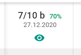
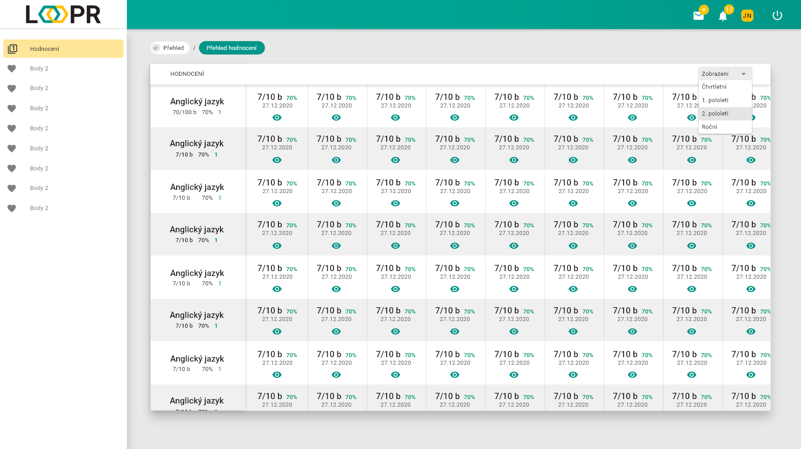
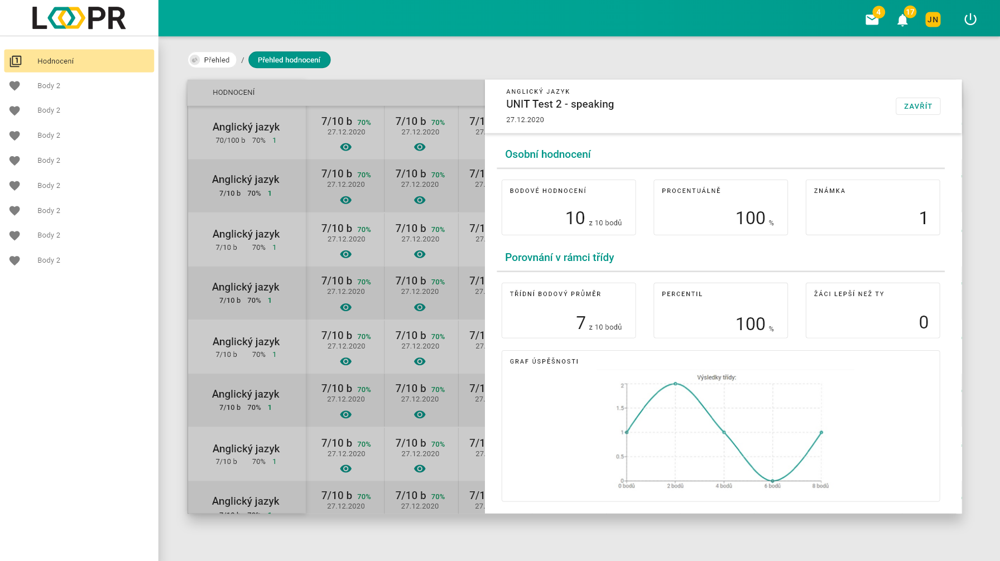

# Studované předměty
Stránka slouží jako přehled klasifikace psaných testů.

## Rozdělení stránky

### Horní lišta s filtrem zobrazení
Ve filtru lze vybrat několik známkovacích období. Podle tohoto výběru se zobrazují jenom některé známky.

Pod lištou se nachází tabulka hodnocení. Každý řádek značí jeden předmět a jeho hodnocení.

### Levý sloupec s předměty
Každá buňka předmětu obsahuje:
* Název předmětu
* Celkový počet získaných bodů a jejich možné maximum
* Celkový počet získaných bodů převedený na procenta
* Známka odpovídající nastavené převodní hodnotě v předmětu, zobrazená v její barvě

### Část s hodnocením
Každá buňka obsahuje:
* Počet získaných bodů a jejich možné maximum
* Počet získaných bodů převedený na procenta, barvou podle odpovídající známky
* Datum uděleného hodnocení
* Zelené tlačítko pro zobrazení [detailu ohodnocení](#Detail)

## Detail
Po kliknutí na `zelené oko` v buňce hodnocení se otevře tato sekce.   

V hlavičce je možné vidět `název testu`, `předmět` a `datum vytvoření testu`.

V sekci `Osobní hodnocení` se nachází:
* Počet získaných bodů a jejich možné maximum
* Počet získaných bodů převedený na procenta
* Známka odpovídající převodní hodnotě v předmětu

V sekci `Porovnání v rámci` se nachází:
* Třídní bodový průměr
* Percentil žáka
* Počet lepších žáků
* Graf úspěšnosti vytvořený na základě předešlých dat

