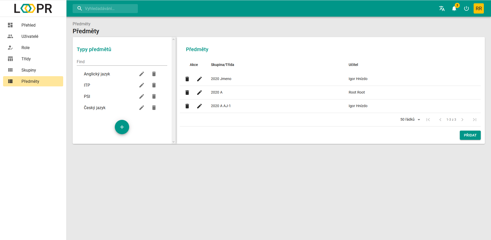
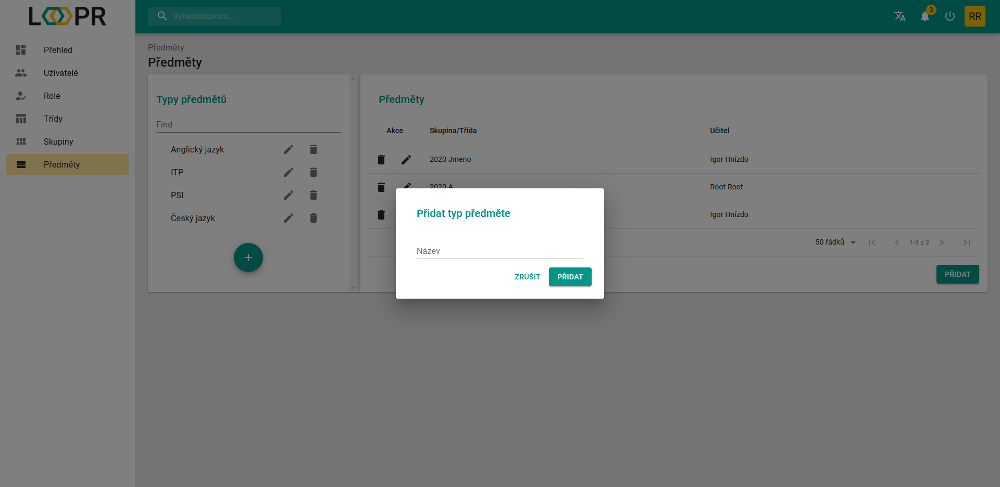
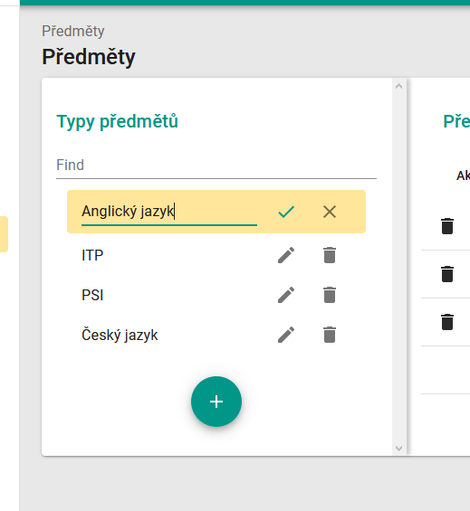
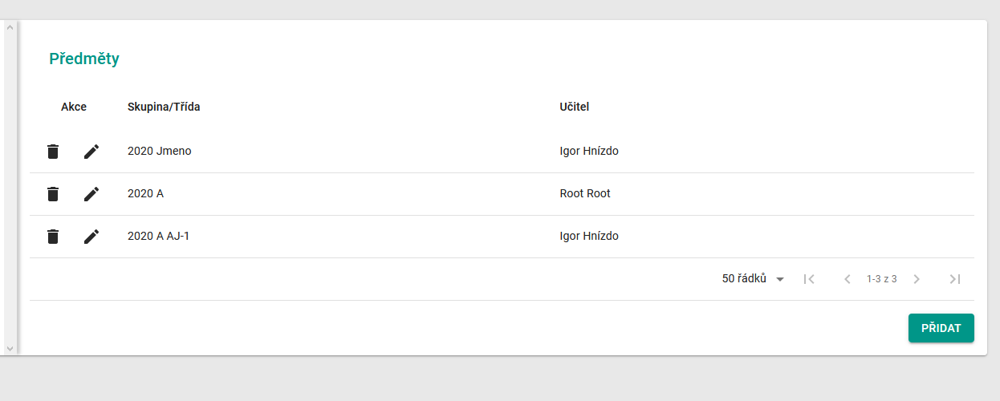
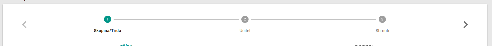
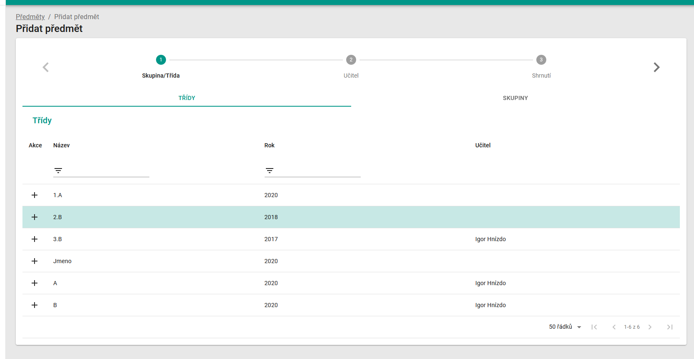
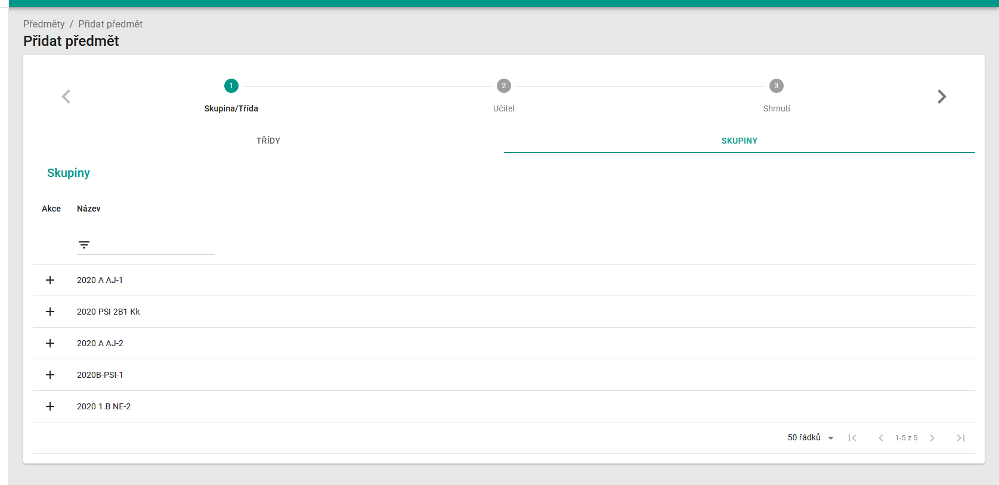
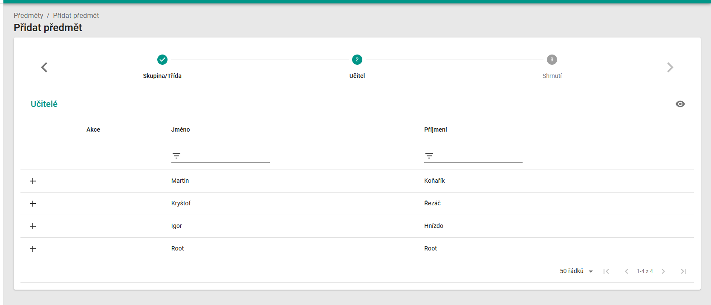
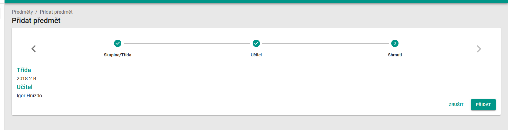

# Předměty
Stránka `Předměty` slouží k přiřazení jedné nebo více skupin k určitému předmětu.

## Rozdělení stránky
Stránka je složená ze dvou sekcí. Z levé sekce "Typy předmětů" a pravé sekce s obsaženými daty o přiřazených skupinách a učiteli.

### Sekce Typy předmětů
Typy předmětů lze vytvořit pomocí `zeleného tlačítka +`.   Otevře se dialog, do kterého je potřeba napsat jeho název.

Každý předmět lze přejmenovat pomocí `ikony tužky` a odstranit pomocí `ikony koše`.

### Sekce s uživatelskými daty
Pro otevření nějakého předmětu vyberte předmět v sekci "Typy předmětů" a klikněte na něj. V této pravé sekci se otevře tabulka s přiřazenímy.   Každé přiřazení lze upravit pomocí `ikony tužky` a odstranit pomocí `ikony koše`.

Všechny ovládací prvky a práce s tabulkou jsou popsány zde: 
> [Datová tabulka](cs/components/materialTable/)

Pro nové přiřazení klikněte na tlačítko `přidat`

#### Princip nového přiřazení/úpravy přiřazení
Přiřazení se skládá z 3 kroků. Pohybovat mezi nimi se můžete pomocí `ikon šipek` v hlavičce.

##### 1. krok - Skupina/Třída
Máte možnost vybrat si zda chcete přiřadit k typu předmětu celou třídu, či pouze nějakou skupinu. Vybrání provedete kliknutím na `tlačítko +`.

##### 2. krok - Učitel
Zde vyberte učitele pro dříve vybranou třídu/skupinu. Opět pomocí kliknutí na `tlačítko +`.

##### 3. krok - Shrnutí
Poslední krok slouží jako shrnutí vybraného přiřazení pro vaší kontrolu. Dokončit proces můžete pomocí `tlačítka přidat`, případně celý proces zrušit pomocí `tlačítka zrušit`.

