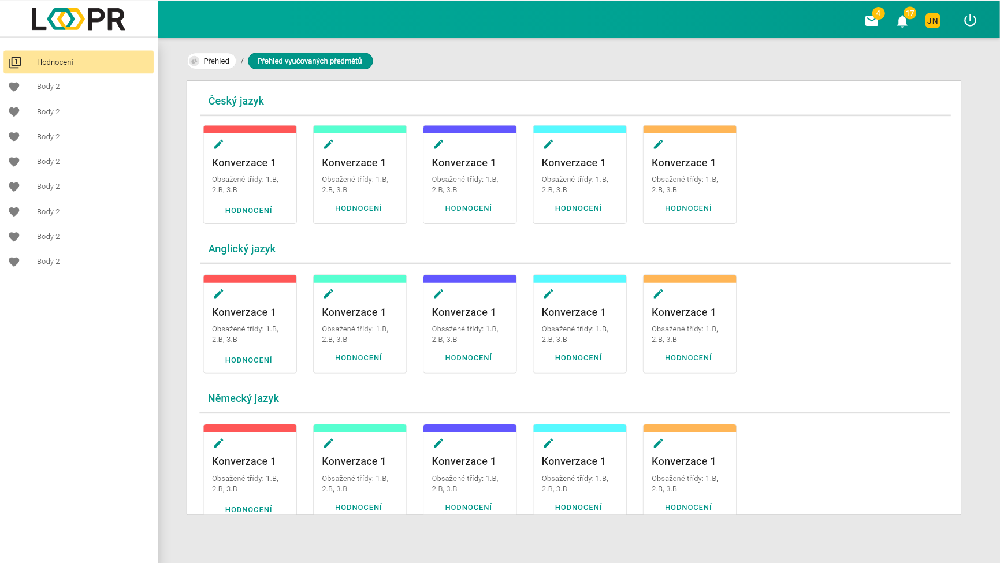

# Vyučované předměty
Zde jsou zobrazeny všechny vyučované skupiny/třídy, rozděleny podle předmětů.
Každý předmět obsahuje: 
* Název skupiny/třídy
* Ikonu tužky pro změnu barvy horního pruhu buňky
* Tlačítko `hodnocení` pro přesměrování do hodnocení předmětu  

Pro změnu barvy horního pruhu buňky, klikněte na `ikonu tužku` nebo na barevný pruh.  

