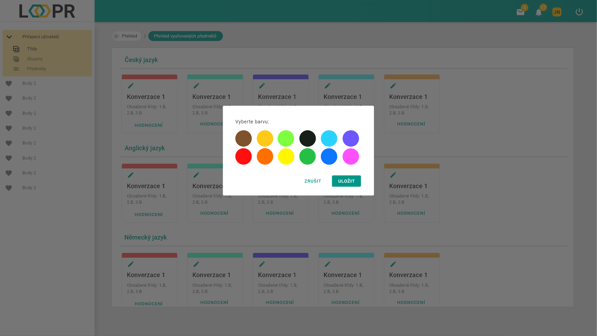

# Vyučované předměty
Zde jsou zobrazeny všechny vyučované skupiny/třídy, rozděleny podle předmětů.

Každá sekce předmětu obsahuje vyučované skupiny/třídy. 
Karta vyučovaného skupiny/třídy obsahuje: 
* Název skupiny/třídy
* Ikonu tužky pro změnu barvy horního pruhu
* Tlačítko `hodnocení`, které slouží k přesměrování do [listu hodnocení této třídy](cs/pages/teacherSubjects/pointSystem/)

Ukázka změny barvy horního pruhu vybrané karty skupiny/třídy, spuštěná kliknutím na `ikonu tužky`.

