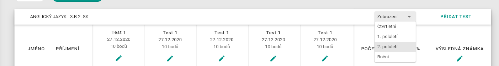
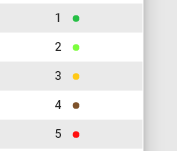
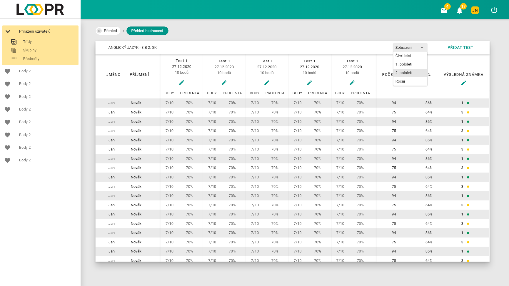
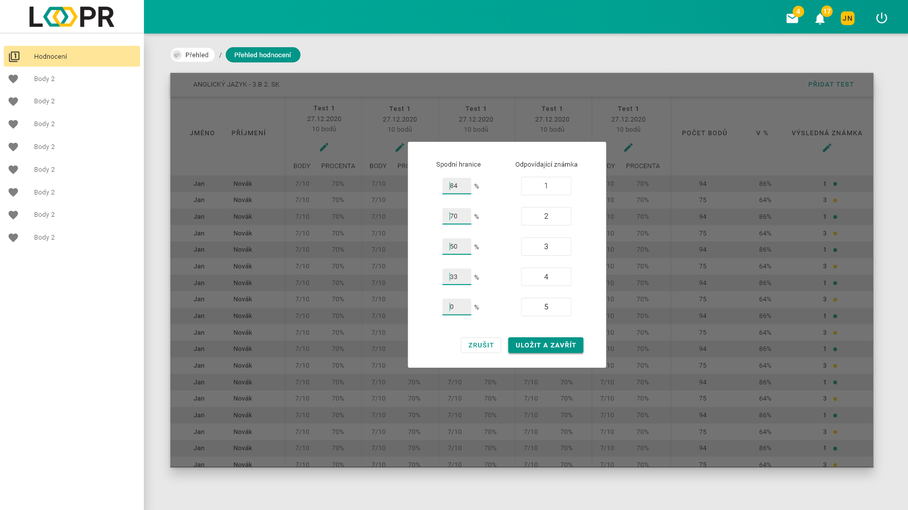
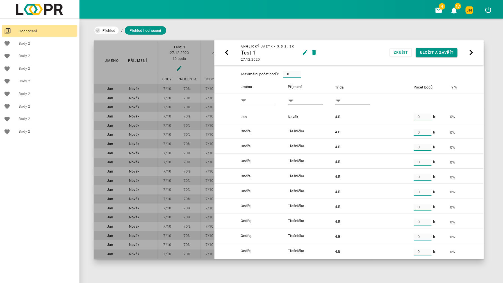

# Bodový systém
Stránka plní funkci přehledu a úpravy klasifikace žáků v daném předmětu.

Na stránce se nachází horní lišta, která obsahuje název rozkliklého předmětu, filtr známkovacího období a tlačítko `přidat test` pro [vytvoření nového testu](#Testy).   

Pod ní je tabulka rozdělena do 3 částí.
### Sloupec s žáky
Obsahuje jména a příjmení jednotlivých žáků. 
### Testy a jejich hodnocení
Každý test je rozdělen na body a procenta. 
Test lze upravit pomocí `ikony tužky` v jeho hlavičce, kde se také nachází jeho jméno, datum vytvoření a počet maximálně získatelných bodů.
### Celkové hodnocení
Shrnutí výsledků ze všech testů, rozdělené do třech sloupců - celkový počet bodů, procenta a výsledná známka odpovídající hodnotě nastavené v [převodníku bodů](#Převodník).   
[Převodník bodů](#Převodník) lze otevřít pomocí `ikony tužky` pod textem `výsledná známka`.  
Ve sloupci `výsledná známka` se nachází pro každý stupěň známky jedna barva, pro větší přehlednost.  

## Převodník
Okno obsahuje 4 textová pole, ve kterých si je možné nastavit spodní hranici procenta pro odpovídající známku.

## Testy
Otevře se okno s listem žáků a textovými poli pro zapsaní jejich bodů.
Pro úpravu maxiálního počtu bodů a názvu testu klikněte na `tlačítko tužky`. Test lze odstranit pomocí `tlačítka koše`.

