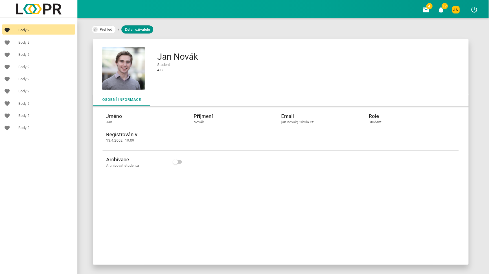

# Detail uživatele
Na stránce `detail uživatele` můžeme vidět veškeré info o daném uživateli.

Nachází se zde informační pole, které lze zároveň změnit pomocí `ikony tužky`:  
* Jméno
* Příjmení
* Email
* Role (učitel/student)
* Datum registrace

Dále je zde možné uživatele archivovat pomocí přepínače v poli `archivace`. 

